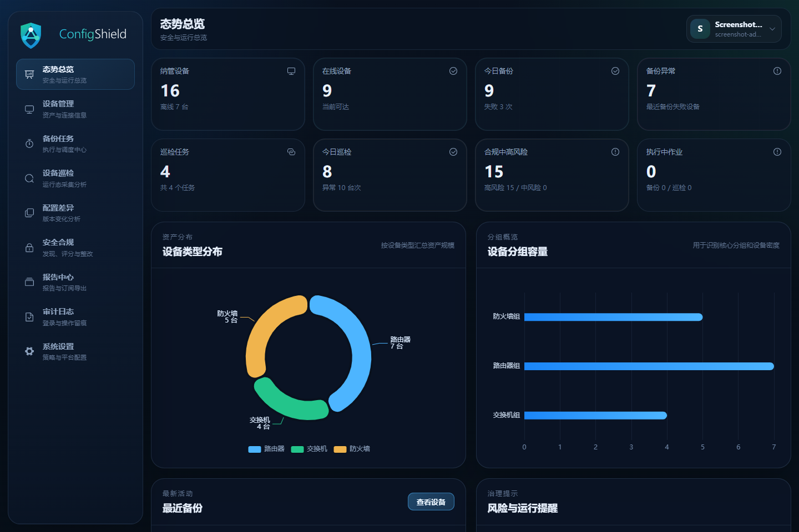
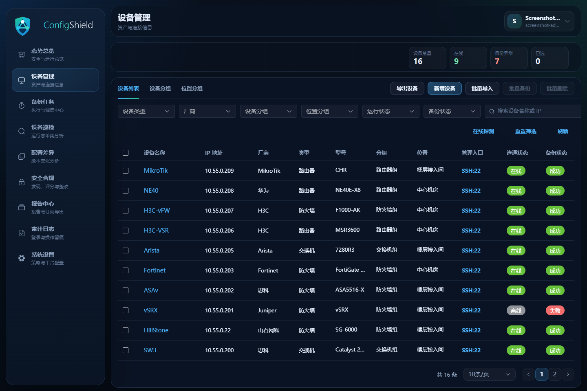
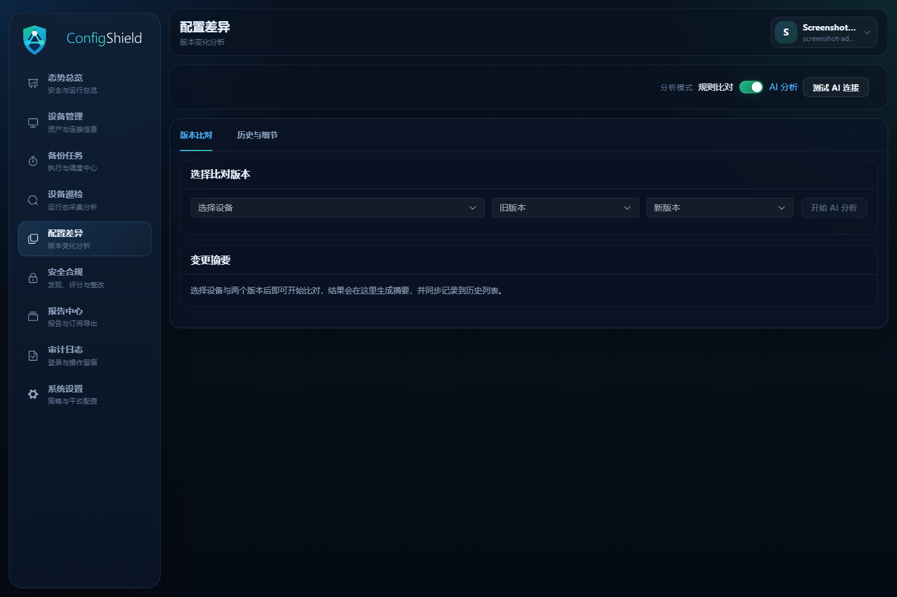
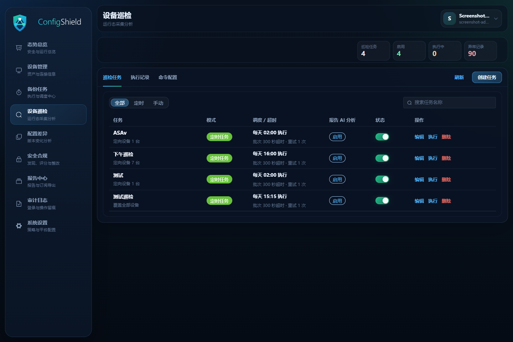
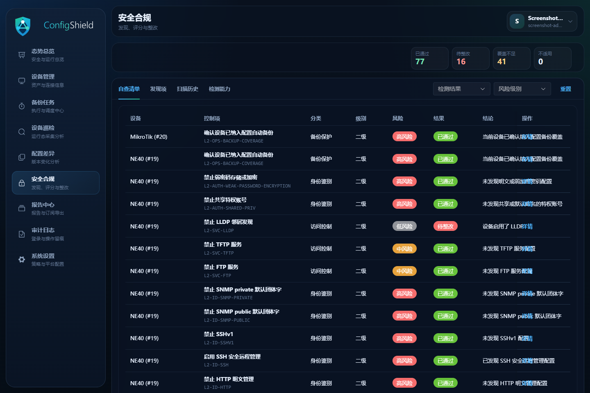

# ConfigShield

ConfigShield 是面向网络设备的配置安全治理平台，用于统一完成设备配置备份、巡检、差异分析、风险发现和报告输出。

平台采用 Docker 离线包交付。用户只需要准备一台已安装 Docker 的 Linux 服务器，下载离线安装包后执行一键安装脚本即可完成部署。

## 产品价值

网络设备配置长期分散在不同厂商、不同设备和不同运维人员手中，常见问题包括：

- 配置变更缺少统一留痕，故障后难以快速回溯。
- 设备备份依赖人工操作，备份结果不稳定。
- 多厂商设备命令和输出格式不一致，巡检和差异分析成本高。
- 安全基线、风险发现和整改验证缺少闭环。
- 项目交付后缺少标准化报告和审计材料。

ConfigShield 的目标是把设备配置从“零散文件”转化为可备份、可比较、可巡检、可审计的安全资产。

## 产品界面

以下截图使用演示数据，展示 ConfigShield 的主要工作界面。

| 态势总览 | 设备管理 |
| --- | --- |
|  |  |

| 配置差异 | 设备巡检 |
| --- | --- |
|  |  |

| 安全合规 |
| --- |
|  |

## 核心功能

| 功能 | 说明 |
| --- | --- |
| 设备管理 | 统一维护网络设备资产、厂商、连接信息和分组。 |
| 配置备份 | 支持手动备份、任务备份、备份历史和失败原因追踪。 |
| 基础差异 | 对不同时间点的配置版本进行差异比较，辅助定位变更。 |
| 基础巡检 | 按巡检模板采集设备状态，形成基础巡检结果。 |
| 风险分析 | 对配置和巡检结果进行风险识别、归类和跟踪。 |
| 安全合规 | 基于规则检查配置安全项，支撑整改闭环。 |
| 报告中心 | 输出备份、巡检、风险和合规相关报告。 |
| 集成告警 | 支持面向外部系统的告警集成能力。 |
| AI 语义分析 | 辅助总结配置差异、风险变化和巡检结论。 |
| 产品授权 | 支持社区版默认授权和专业版授权导入，用于控制 ConfigShield 自身版本能力和设备额度。 |

## 版本说明

| 版本 | 适用场景 | 设备额度 | 功能范围 |
| --- | --- | --- | --- |
| 社区版 | 试用、小规模自用、基础备份和基础巡检 | 8 台 | 设备管理、配置备份、基础差异、基础巡检 |
| 专业版 | 正式生产、项目交付、多功能治理 | 授权文件指定 | 全部功能 |

系统安装后无须导入授权即可进入社区版。需要使用专业版能力或更多设备额度时，通过授权页面生成申请信息，再导入由 ULC 授权系统签发的授权文件。

## 支持的设备方向

当前产品已经覆盖或完成备份链路验证的设备方向包括：

- Huawei
- H3C
- Cisco
- Juniper
- Arista
- Fortinet
- Hillstone
- MikroTik
- Ruijie

实际适配效果受设备型号、系统版本、账号权限、命令回显和现场网络质量影响。正式接入前建议先选取代表性设备完成备份、巡检和差异验证。

## 部署要求

### 操作系统

推荐使用：

```text
Ubuntu Server 24.04 LTS / 26.04 LTS x86_64
```

其他 Linux 发行版只要支持 Docker Engine 24+ 和 Docker Compose v2，通常也可以运行，但正式交付建议优先使用 Ubuntu Server LTS。

### 必需软件

```bash
docker --version
docker compose version
```

### 硬件建议

| 场景 | CPU | 内存 | 磁盘 | 适用范围 |
| --- | --- | --- | --- | --- |
| 最低测试/演示 | 2 core | 2 GB | 20 GB | 功能验证、短期试用、少量设备 |
| 小规模生产推荐 | 2 core | 4 GB | 50 GB | 社区版或小规模专业版 |
| 较多设备/长期留存 | 4 core | 8 GB | 100 GB+ | 更多设备、更多巡检、长期保存备份和报告 |

磁盘主要用于 MySQL 数据、设备配置备份、巡检结果、报告导出和授权文件。设备数量越多、备份保留周期越长，磁盘空间应预留越多。

## 快速安装

1. 获取离线包和校验文件：

```text
configshield-<version>.tar.gz
configshield-<version>.tar.gz.sha256
```

2. 上传到目标服务器并校验：

```bash
sha256sum -c configshield-<version>.tar.gz.sha256
tar -xzf configshield-<version>.tar.gz
cd configshield-<version>
sha256sum -c SHA256SUMS
```

3. 执行一键安装：

```bash
sudo bash ./quick-offline-install.sh
```

默认安装目录：

```text
/opt/configshield
```

默认访问端口：

```text
18004
```

安装完成后终端会显示初始管理员账号。默认用户名为 `admin`，随机密码只显示一次，请立即保存。

## 自定义安装

指定端口和安装目录：

```bash
CONFIGSHIELD_INSTALL_DIR=/opt/configshield \
API_HOST_PORT=18004 \
sudo bash ./quick-offline-install.sh
```

指定初始管理员密码：

```bash
CONFIGSHIELD_ADMIN_USERNAME=admin \
CONFIGSHIELD_ADMIN_PASSWORD='请替换为自己的强密码' \
CONFIGSHIELD_ADMIN_REAL_NAME='System Admin' \
sudo bash ./quick-offline-install.sh
```

## 常用运维命令

在离线包解压目录执行：

```bash
bash ./quick-offline-install.sh status
bash ./quick-offline-install.sh repair
bash ./quick-offline-install.sh upgrade
bash ./quick-offline-install.sh restart
bash ./quick-offline-install.sh logs
bash ./quick-offline-install.sh uninstall
```

`uninstall` 只停止并移除容器，不会删除安装目录下的持久化数据。

## 数据持久化

ConfigShield 的数据默认保存在：

```text
/opt/configshield
```

主要数据目录包括：

```text
/opt/configshield/data/mysql
/opt/configshield/data/redis
/opt/configshield/data/backups
/opt/configshield/data/exports
/opt/configshield/license
```

升级、修复和容器重建不会主动删除这些目录。生产环境建议把 `/opt/configshield` 纳入主机备份策略。

## 备份与恢复

备份：

```bash
CONFIGSHIELD_INSTALL_DIR=/opt/configshield \
bash ./backup.sh
```

恢复前先完成同版本安装，然后执行：

```bash
CONFIGSHIELD_INSTALL_DIR=/opt/configshield \
bash ./restore.sh /path/to/configshield-backup-YYYYmmddTHHMMSSZ.tar.gz
```

## 文档

完整安装步骤、升级、修复、卸载、备份恢复、授权和故障排查请阅读：

- [ConfigShield 安装部署手册](docs/ConfigShield-安装部署手册.md)
